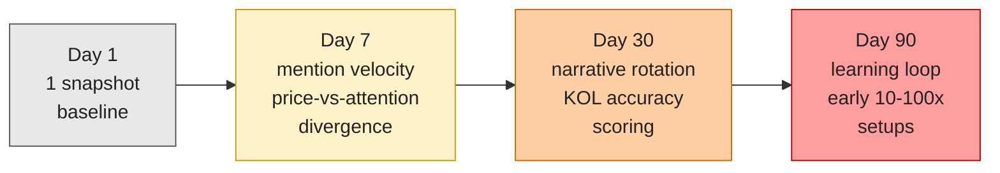
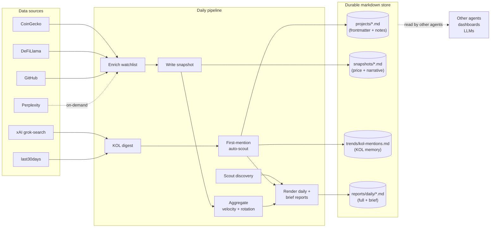
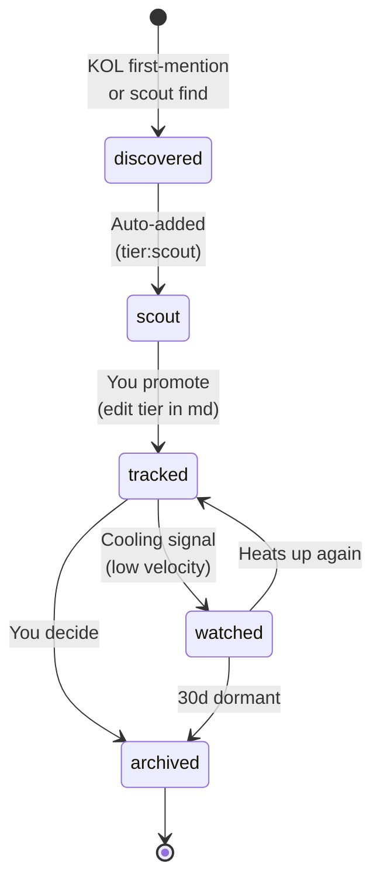
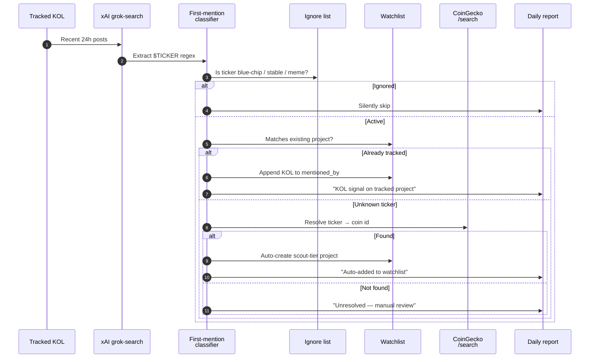
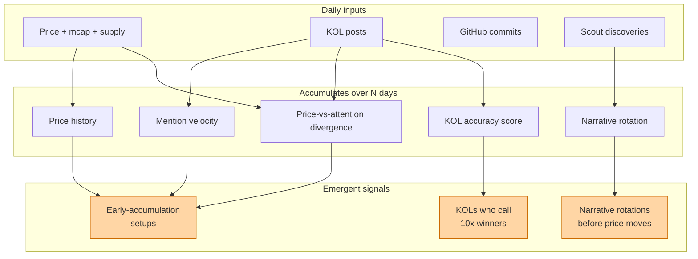

# Gold Digger

**A compounding research engine for early crypto-AI projects.** Daily watchlist enrichment, KOL signal digest, scout discovery, narrative rotation, and Perplexity-backed deep dives — all written as plain markdown so other agents can read it without an API.

> **Goal:** surface projects — with or without a token today — that could 10–100x during the next bull run, by turning daily research into an auditable data trail that gets smarter every day.

---

## Why "compounding"?

A one-off crypto research session is shallow. The value comes from running Gold Digger every day and letting the data accumulate. Here's what emerges over time:



One run is a lookup. Seven runs reveal velocity. Thirty runs show which narratives are rotating in. Ninety runs start scoring your KOLs by their hit rate. Gold Digger is not a query tool — it's a research loop.

---

## Gold Digger vs. last30days

Gold Digger is built on top of [last30days](https://github.com/mvanhorn/last30days-skill) — it calls last30days for social + web research and adds a crypto intelligence layer on top. They solve different problems:

| | Gold Digger | last30days |
|---|---|---|
| **Core job** | Intelligence — track what's changing and what the change means | Recall — cast a wide net across social platforms |
| **Time horizon** | Compounding: "day 1 vs day 7 vs day 30 vs day 90" | Snapshot: "what happened in the last 30 days?" |
| **Memory** | Everything — snapshots, KOL memory, project files, trends | None by default (SQLite store is opt-in) |
| **Market data** | CoinGecko price/mcap/supply, DeFiLlama TVL, GitHub commits | Zero |
| **Output** | Mention velocity, price-vs-attention divergence, narrative rotation, KOL accuracy scoring | Raw findings per query |
| **Entity understanding** | `"circle"` = ambiguous word, requires crypto context to count as Circle the company | `"circle"` = a string |
| **Structure** | Markdown project files with frontmatter schema, readable by Obsidian and other agents | JSON blob per run |
| **KOL tracking** | Persistent memory of every KOL call, first-mention auto-scout, dedup, accuracy backtest | Can search a handle's posts |
| **Who reads it** | Other agents, dashboards, LLMs, Obsidian — plain files, no API needed | The human who ran it |

**last30days is Gold Digger's ears.** It hears what the internet is saying right now. **Gold Digger is the brain** that remembers what the ears heard yesterday, notices when today sounds different, and compounds that into actionable intelligence over weeks and months.

Without last30days, Gold Digger has market data but no social signal. Without Gold Digger, last30days is a firehose that resets every run.

---

## Quick start

```bash
# 1. Install (choose your harness)
/plugin install github.com/skyzer/gold-digger        # Claude Code
openclaw install github.com/skyzer/gold-digger       # OpenClaw
codex plugin install github.com/skyzer/gold-digger   # Codex
hermes install github.com/skyzer/gold-digger         # Hermes

# 2. Put your API keys in one place (reused by any local tool)
mkdir -p ~/.config/shared && chmod 700 ~/.config/shared
cat > ~/.config/shared/.env << 'EOF'
export COINGECKO_API_KEY="..."
export XAI_API_KEY="..."
export PERPLEXITY_API_KEY="..."
export BRAVE_API_KEY="..."
export GITHUB_TOKEN="..."
EOF
chmod 600 ~/.config/shared/.env
echo 'if [ -f "$HOME/.config/shared/.env" ]; then set -a; . "$HOME/.config/shared/.env"; set +a; fi' >> ~/.bash_profile

# 3. Verify keys + sources
gold-digger setup

# 4. Populate your watchlist (copy-paste-able examples)
gold-digger add-project unigox                                                              # pre-token, AI-crypto
gold-digger add-project ai16z        --coingecko-id ai16z           --twitter ai16zdao     --narrative ai-agents
gold-digger add-project openserv     --coingecko-id openserv         --twitter openservAI   --narrative ai-agents
gold-digger add-project bittensor    --coingecko-id bittensor        --twitter opentensor   --narrative ai-infra

# 5. Follow a few KOLs
gold-digger add-kol DegenSensei --focus ai-crypto,low-cap
gold-digger add-kol resdegen    --focus ai-crypto,low-cap
gold-digger add-kol andyyy      --focus ai-crypto

# 6. Run the first daily pipeline
gold-digger daily
```

Reports land in `$GOLD_DIGGER_DATA/reports/daily/YYYY-MM-DD.md`. Default data directory is `~/Documents/GoldDigger/` — point Obsidian at it to browse as a knowledge graph.

---

## Architecture — how data flows



Every arrow is a plain-text write. Every store is a flat file. No database, no API layer — any tool that reads markdown or parses an embedded JSON block can consume Gold Digger's output.

---

## Project lifecycle — state machine



Projects flow through tiers based on signal, not buckets. You always have the final say — Gold Digger auto-adds and auto-suggests, but promotion to `tracked` and archiving is a manual frontmatter edit. Every transition is preserved in the project file's git history.

---

## KOL first-mention flow

Tracked KOLs are a source of alpha *if* you can capture every ticker they mention, resolve it to a real project, and dedupe against what you already know. Gold Digger does this every day:



The persistent memory file `trends/kol-mentions.md` records every (KOL, ticker) pair so the same mention never re-triggers, and builds a long-term record you can backtest: "which of DegenSensei's first-mentions 2x'd within 30 days?"

---

## Where the value compounds



The orange nodes on the right are what Gold Digger is built to surface. None of them are visible on day 1. All of them emerge as the daily markdown trail grows.

---

## What it does

**Two modes, both always on:**

1. **Watchlist enrichment** — every tracked project gets refreshed daily: price, mcap, FDV, 24h/7d/30d %, supply, TVL, GitHub commits, follower deltas, KOL mention count.
2. **Scout discovery** — finds new projects via CoinGecko new listings, DeFiLlama protocols, KOL first-mentions, and Perplexity/Brave web search. Scout finds enter the watchlist as `tier: scout` for light tracking. You manually promote the interesting ones to `tier: tracked`.

**On-demand tools:**
- `gold-digger research <slug>` — Perplexity-powered cited DD brief
- `gold-digger kols [--since-hours N]` — KOL digest over any window
- `gold-digger first-mentions` — run the first-mention auto-scout in isolation
- `gold-digger scout` — scout pass without enrichment

**Daily reports** (two markdown files per day):
- `YYYY-MM-DD.md` — full report: new discoveries, watchlist deltas, KOL digest, first-mentions, narrative rotation, heating up, action queue
- `YYYY-MM-DD-brief.md` — 5-bullet TL;DR for quick morning read

---

## Designed for other agents to consume

Gold Digger writes plain markdown and embedded JSON. Any LLM, dashboard, CLI, or other agent can read the data directory without going through Gold Digger itself:

```bash
# List tracked projects
ls ~/Documents/GoldDigger/projects/

# Filter by narrative
grep -l "narrative:.*ai-agents" ~/Documents/GoldDigger/projects/*.md

# Feed a project to an LLM for synthesis
cat ~/Documents/GoldDigger/projects/openserv.md | llm "what should I watch for?"

# Parse yesterday's snapshot CSV block
awk '/```csv/,/```/' ~/Documents/GoldDigger/snapshots/$(date +%Y-%m-%d).md

# Read the full KOL memory
cat ~/Documents/GoldDigger/trends/kol-mentions.md

# Check what DegenSensei has been mentioning
grep "DegenSensei" ~/Documents/GoldDigger/trends/kol-mentions.md
```

**Project files are the contract.** If you want to add your own findings to a tracked project without breaking Gold Digger's schema, append to the body of the `.md` file — Gold Digger never touches the body on enrichment, only the frontmatter. Your notes compound alongside the automated data.

---

## API key matrix

Nothing is required. Gold Digger runs with zero keys — just with progressively weaker signal. Add keys to unlock features.

| Key / tool | Cost | Unlocks | Lost without it |
|---|---|---|---|
| `COINGECKO_API_KEY` | Free Demo / Pro paid | Price, mcap, FDV, 24h/7d/30d %, supply, exchange listings, new-listing scout | **Severe** — no price data, no new-token scout |
| `DEFILLAMA` *(no key)* | Free | TVL, revenue/fees, AI-tagged protocol scout | No TVL, no DeFi scout |
| `GITHUB_TOKEN` | Free via `gh` | Commits/stars Δ, dev-to-price divergence | No GitHub signals |
| `XAI_API_KEY` | ~$0.02–0.20/call | KOL feeds, first-mention auto-scout, X announcements | **Major** — no KOL digest, no X alpha |
| `PERPLEXITY_API_KEY` | Paid, cheap | Cited deep-research for DD subagent | Research falls back to raw search |
| `BRAVE_API_KEY` | Free 2k/mo | Open-web scout for pre-launch teasers | Web scout limited |
| `EXA_API_KEY` | Free 1k/mo | Semantic-search scout ("projects like ai16z") | Alt to Brave |
| `OPENROUTER_API_KEY` | Paid, cheap | Alt Perplexity Sonar path via OpenRouter | Alt to Perplexity direct |
| `SCRAPECREATORS_API_KEY` | 10k free | TikTok/IG crypto influencers | Skip for v1 |
| `BSKY_HANDLE` + `BSKY_APP_PASSWORD` | Free | Bluesky chatter | Minor |
| `yt-dlp` binary | Free | YouTube crypto channels | No YT signals |

**Minimum recommended:** `COINGECKO_API_KEY` + `XAI_API_KEY` + `BRAVE_API_KEY`. That unlocks the core price/KOL/web triad.

---

## Where to put keys

Gold Digger looks in this order (first hit wins):

1. **Process environment** — anything `export`ed in your shell. *Primary path.*
2. **`~/.config/shared/.env`** — **recommended**, reused by any local tool
3. `~/.config/last30days/.env` — inherit from last30days
4. `~/.config/cowork/.env` — Anthropic Cowork shared location
5. `~/.config/gold-digger/.env` — dedicated fallback
6. macOS Keychain — `gold-digger setup --keychain`
7. 1Password CLI references — `op://Personal/GoldDigger/KEY`

Keys never appear in reports, logs, or committed files. Masked (`xai-****…****`) in any debug output.

---

## Storage layout (Obsidian-friendly)

```
$GOLD_DIGGER_DATA/
├── projects/
│   ├── ai16z.md            # frontmatter = structured data, body = your notes
│   ├── openserv.md
│   └── ...
├── kols/
│   ├── degensensei.md
│   └── resdegen.md
├── reports/
│   └── daily/
│       ├── 2026-04-15.md         # full report
│       └── 2026-04-15-brief.md   # TL;DR
├── snapshots/
│   └── 2026-04-15.md       # human table + CSV block + narrative JSON
├── trends/
│   └── kol-mentions.md     # persistent KOL memory
└── research/
    └── openserv-2026-04-15.md    # Perplexity cited briefs
```

Point Obsidian's vault root at this directory and you get a browsable research graph: reports wiki-link `[[project]]`, project pages show Properties panel, backlinks work automatically.

---

## Project schema (frontmatter fields)

See [`references/schema.md`](references/schema.md) for the full spec. Summary:

- **Identity** — slug, name, ticker, narrative tags, chains, website, twitter, github, coingecko_id
- **Token** — has_token, price, mcap, fdv, 24h/7d/30d %, supply, exchanges, tge_date
- **Funding** — raised_usd, latest_round, valuation, investors
- **Traction** — twitter followers + Δ, github stars/commits/contributors, tvl, mainnet_status
- **Catalysts** — points_farming, airdrop_eligible, features_shipped, upcoming_tge
- **KOL signal** — mentioned_by, mention_count_7d/30d, mention_velocity
- **Risk** — audit_status, team_doxxed, vc_unlock_schedule, red_flags
- **Meta** — tier (tracked/scout/archived), first_added, last_updated, sources

---

## Extending

Four extension points, all documented in [`references/extending.md`](references/extending.md):

1. **Data sources** — drop a Python file in `scripts/sources/_custom/` subclassing `Source`. Auto-discovered.
2. **Signal extractors** — drop a file in `scripts/extractors/_custom/` to parse source output for new patterns.
3. **Narrative taxonomy** — edit [`references/narratives.md`](references/narratives.md) to add tags, keywords, seeds.
4. **Custom scoring** — replace `scripts/lib/scoring.py` to weight signals to your taste.

You can also tune the ignore list — edit [`references/ignore.md`](references/ignore.md) to add tickers Gold Digger should silently skip (blue chips, stables, memes, etc.).

---

## Dependencies

- **Python 3.12+**
- **[last30days](https://github.com/mvanhorn/last30days-skill)** — social and web research engine. Install first; Gold Digger calls it via subprocess for Reddit / HN / YouTube / web signals. Without it, Gold Digger degrades to market data + GitHub + XAI + Perplexity.
- `uv` (recommended) or `pip` for Python deps
- `gh` CLI (optional, for GitHub auth inheritance)

---

## Roadmap

- **v0.1** — Skeleton, schema, CoinGecko, markdown storage ✅
- **v0.2** — DeFiLlama, GitHub, XAI KOL, last30days adapter, Perplexity research, daily pipeline ✅
- **v0.3** — Ignore list, KOL first-mention auto-scout, narrative rotation ✅
- **v0.4** — Clean Quick Start (no seed/), add-kol command, Mermaid diagrams ✅
- **v0.5** — Field provenance `.history.jsonl`, `gold-digger export` unified JSON, integration patterns doc
- **v1.0** — Cookie.fun / Virtuals native sources, insider wallet tracking, CEX listing announcement watcher

---

## License

MIT. See [LICENSE](./LICENSE).
